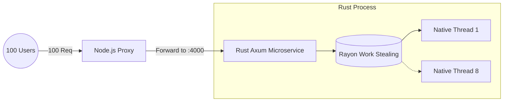

<TechBadge text="Node.js" bg="bg-green-900 border-green-700" /> <TechBadge text="Rust" bg="bg-orange-900 border-orange-700" /> <TechBadge text="Redis" bg="bg-red-900 border-red-700" /> <TechBadge text="System Design" bg="bg-blue-900 border-blue-700" />

Node.js’s event-driven, single-threaded V8 engine shines incredibly bright in concurrent, I/O-intensive web traffic scenarios. But when faced with massive, CPU-bound calculations (like counting 20 million operations), Node's event loop completely stalls out, severely punishing your users due to blocked API paths.

In a recent architectural investigation, I ran heavily abusive load tests against four distinct performance strategies using <TechBadge text="autocannon" bg="bg-pink-900 border-pink-700" />.

<TerminalWindow title="bash">
$ npm install -g autocannon
$ autocannon -c 100 -d 10 http://localhost:3000/heavy

Running 10s test @ http://localhost:3000/heavy
100 connections
</TerminalWindow>

<Metrics data={[
  { label: "Piscina Throughput", value: "105 req/s" },
  { label: "Rust Service Speed", value: "500 req/s" },
  { label: "Rust Latency", value: "195 ms" },
  { label: "BullMQ Throughput", value: "15k req/s" }
]} />

<Step number="1" title="Unpooled OS Threads (The Crash & Burn)">
Naivety says "just spawn a new `worker_thread` for every incoming request." Under any significant load, this strategy initiates a complete catastrophe.

<CodeDiff 
  before={`app.get('/heavy', (req, res) => {
  // DANGER: Unbounded OS thread spawn
  const worker = new Worker('./heavy.js'); 
});`} 
  after={`app.get('/heavy', async (req, res) => {
  // SAFE: Bounded thread pool execution
  const result = await pool.run({ task: req.body });
  res.send(result);
});`}
/>

<Callout type="danger" title="Timeout">

<strong>Total Requests:</strong> 0. 
Spawning 100 math requests at once statically creates 800 independent background OS-level threads. The memory footprint skyrockets, and OS-context switching completely consumes the CPU time.

</Callout>

</Step>

<Step number="2" title="The Traffic Cop (Piscina Thread Pooling)">
Instead of wild threading, we introduce a bounded, static capacity using `piscina`. It boots up a strictly limited **Pool of 8 Threads**—matching the physical CPU cores perfectly—and queues the rest in memory.

Here, 8 requests run, while the other 92 wait completely safely in line.

<ProsCons 
  pros={[
    "Total Requests Processed: ~1,050",
    "Average Latency: ~915ms",
    "Event Loop Protection: The API remains deeply stable.",
    "Native production approach for 10ms - 2s tasks."
  ]}
/>

</Step>

<Step number="3" title="The Heavy Lifter (Rust API Microservice)">
To dramatically accelerate beyond V8's internal ceilings, we treat Node purely as an API Gateway. We extract the heavy lifting to a true compiled language using <TechBadge text="Axum" /> and <TechBadge text="Rayon" /> inside **Rust**.

**The Results: Blistering.** Even though Node and Rust send payloads back and forth over a local HTTP socket (costing a minor network latency penalty), Rust compiles to bare-metal machine code. It processed **~4,973 requests** with zero timeouts at a phenomenal `195ms` latency (an astounding **~500 req/sec** throughput). 

</Step>

<Step number="4" title="Enterprise Event-Driven Queue (BullMQ + Redis)">
How is operations clustering *actually* handled in Enterprise production for tasks taking anywhere from 5 seconds to 5 hours? They decouple the web application completely via **Async Queuing**.

<TerminalWindow title="docker-compose.yml">
version: '3.8'
services:
  redis:
    image: redis:6-alpine
    ports:
      - "6379:6379"
</TerminalWindow>

<Callout type="info" title="Decoupled Architecture Flow">

1. The <strong>API Gateway</strong> intercepts the HTTP request. 
2. It pushes the payload data directly into a dedicated Message Broker (Redis/BullMQ). 
3. Node.js replies instantly: <em>"HTTP 202 Accepted"</em>. 
4. A completely separate backend application natively polls the Redis stack, executes the heavy work, and updates the database.

</Callout>

### Benchmark Results: The Independence Factor

The Express API processed an absolute staggering **~150,000+ total requests** reaching phenomenons of **~15,000 requests/sec** and an imperceptible gateway response latency measuring `~6ms`.

</Step>

<KeyTakeaway>
There is no "silver bullet" to performance, only trade-offs. 
  
For quick math under a second, use a `Worker Pool` like Piscina to keep the ecosystem pure Javascript. If the task is heavily algorithmic, porting the module to a <b>Rust Microservice</b> yields a blistering 5x latency advantage. Finally, if the operation is slow, unpredictable, and user-facing completion can be delayed... completely detach the workload utilizing an <b>Enterprise Messaging Queue</b>. 
</KeyTakeaway>

