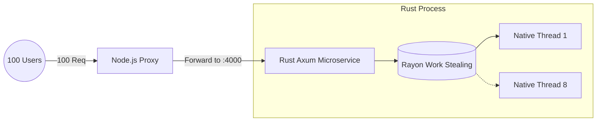

Node.js’s event-driven, single-threaded V8 engine shines incredibly bright in concurrent, I/O-intensive web traffic scenarios. But when faced with massive, CPU-bound calculations (like counting 20 million operations), Node's event loop completely stalls out, severely punishing your users due to blocked API paths.

In a recent architectural deep investigation, I benchmarked four distinct strategies to conquer this problem and load-tested them heavily under a 100-user barrage for 10 seconds using `autocannon`. Here is the journey of scaling Node.js CPU-bound tasks.

<Metrics data={[
  { label: "Piscina Throughput", value: "105 req/s" },
  { label: "Rust Service Speed", value: "500 req/s" },
  { label: "Rust Latency", value: "195 ms" },
  { label: "BullMQ Throughput", value: "15k req/s" }
]} />


<div className="mt-12">
<Step number="1" title="Unpooled OS Threads (The Crash & Burn)">
Naivety says "just spawn a new `worker_thread` for every incoming request." Under any significant load, this strategy initiates a complete catastrophe.

```javascript
import { Worker } from 'worker_threads';

app.get('/heavy', (req, res) => {
  // DANGER: Spawning an unbounded OS-level thread!
  const worker = new Worker('./heavy-task.js'); 
});
```

<Callout type="danger" title="Timeout">
<p>
<strong>Total Requests:</strong> 0.<br/>
Spawning 100 math requests at once statically creates 800 independent background OS-level threads. The memory footprint skyrockets, and OS-context switching completely consumes the CPU time. The server inflicts a devastating DoS (Denial of Service) attack on itself, causing universal request timeouts.
</p>
</Callout>

</Step>

<Step number="2" title="The Traffic Cop (Piscina Thread Pooling)">
Instead of wild threading, we introduce a bounded, static capacity using `piscina`. It boots up a strictly limited **Pool of 8 Threads**—matching the physical CPU cores perfectly—and queues the rest in memory.

```javascript
import Piscina from 'piscina';

const pool = new Piscina({ filename: './heavy-task.js', maxThreads: 8 });

app.get('/heavy', async (req, res) => {
  const result = await pool.run({ task: req.body });
  res.send(result);
});
```

Here, 8 requests run, while the other 92 wait completely safely in line.

<ProsCons 
  pros={[
    "Total Requests Processed: ~1,050",
    "Average Latency: ~915ms",
    "Event Loop Protection: The Node.js Express server remains perfectly stable.",
    "A true production-ready approach for short tasks taking 10ms - 2 seconds."
  ]}
/>

</Step>

<Step number="3" title="The Heavy Lifter (Rust API Microservice)">
To dramatically accelerate beyond the limits of Javascript's V8 engine entirely, we treat Node purely as an API Gateway. We build a standalone Microservice using **Rust**, extracting the heavy math to a true compiled language using `axum` and `rayon`.



**The Results: Blistering.**

Even though Node and Rust send payloads back and forth over a local HTTP socket (costing a minor network latency penalty), Rust compiles to bare-metal machine code. It chewed through millions of integers and processed **~4,973 requests** with zero timeouts at a phenomenal `195ms` latency (an astounding **~500 req/sec** throughput). It completely obliterates native pool performance internally by 5x factors.

</Step>


<Step number="4" title="Enterprise Event-Driven Queue (BullMQ + Redis)">
How is operations clustering *actually* handled in Enterprise production for tasks taking anywhere from 5 seconds to 5 hours? They decouple the web application completely via **Async Queuing**.

<Callout type="info" title="Decoupled Architecture Flow">
<p>
1. The <strong>API Gateway</strong> intercepts the HTTP request.<br/>
2. It pushes the payload data directly into a dedicated Message Broker (Redis/BullMQ).<br/>
3. Node.js replies instantly: <em>"HTTP 202 Accepted (Your report is generating...)"</em>.<br/>
4. A completely separate Rust backend server naturally polls the Redis stack, executes the heavy work, and updates the database.
</p>
</Callout>

### Benchmark Results: The Independence Factor

The Express API processed an absolute staggering **~150,000+ total requests** reaching phenomenons of **~15,000 requests/sec** and an imperceptible gateway response latency measuring `~6ms`.

**The "Cheating" Benchmark:** The Node.js server survives flawlessly because it *isn't doing the math anymore*. It just writes to the database safely and walks away, protecting the main thread entirely.

If the Express web server crashes... the Rust backend workers keep burning through the backlog natively. Total structural independence. 

</Step>
</div>
