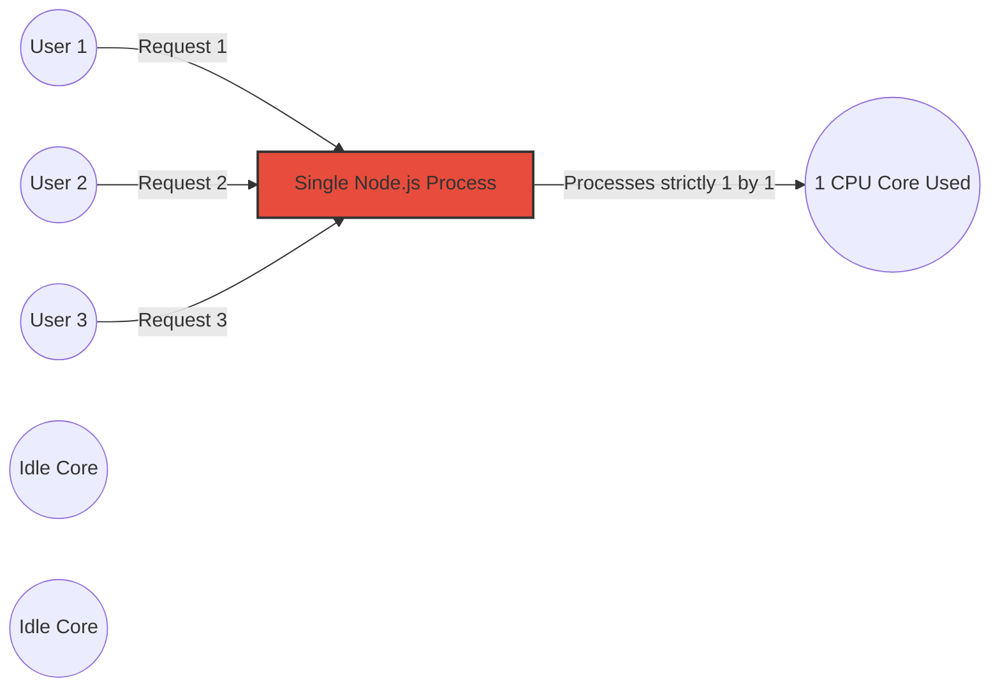

<TechBadge text="Node.js" bg="bg-green-900 border-green-700" />
<TechBadge text="Docker" bg="bg-blue-900 border-blue-700" />
<TechBadge text="Kubernetes" bg="bg-indigo-900 border-indigo-700" />
<TechBadge text="AWS EKS" bg="bg-orange-900 border-orange-700" />

Node.js is famously **single-threaded**. This design makes it incredibly lightweight and efficient for I/O-bound HTTP tasks, but what happens when you need guaranteed enterprise availability and hardware-level elasticity under tremendous load?

If you run a heavy computation loop, it practically blocks the entire process, preventing any other users from accessing your API. Recently, I conducted a full-scale architectural journey to systematically break through these physical limits. Here is how I took a standard Node.js server and escalated it natively up to a dynamic **AWS EKS (Elastic Kubernetes Service)** cluster.

<Metrics
  data={[
    { label: "Autocannon RPS", value: "5,000" },
    { label: "K8s Pods Scaled", value: "20" },
    { label: "Timeouts Slashed", value: "- 85%" },
    { label: "AWS Worker Nodes", value: "c5.xlarge" },
  ]}
/>

<Step number="1" title="The Single-Thread Problem (Event Loop Blocks)">
By default, the V8 engine interprets Javascript sequentially. When 5,000 requests hit an unscaled Node.js server running heavy math, calculations wait in a queue. Because the server only has one core functioning, latency spikes drastically and web connections drop.

</Step>

<Step number="2" title="Vertical Scaling (PM2)">
To fix the single-thread limit running on one single machine (like a laptop or dedicated VM), we use <TechBadge text="PM2" />. Instead of writing complex `node:cluster` branching logic in Javascript, PM2 automatically spawns multiple instances of the exact app to map beautifully across all available physical CPU cores!

<TerminalWindow title="bash">
  $ npm install -g pm2 $ pm2 start index.js -i max
</TerminalWindow>

<Callout type="warning" title="The Hardware Wall">
  PM2 handles zero-downtime restarts and distributes the load flawlessly.
  However, if incoming traffic exhausts the total CPU cores belonging to that{" "}
  <em>single hardware machine</em>, the application fundamentally crashes
  anyway. You need to detach from bare metal!
</Callout>

</Step>

<Step number="3" title="Horizontal Scaling (Docker & Kubernetes)">
The solution to the Hardware Wall is decoupling the Node application from the machine entirely. We package the PM2 setup inside a **Docker Container** using Alpine Linux. PM2 is told to dynamically adapt to whatever subset of CPU limits Kubernetes injects!

**The Production `k8s.yaml` Configuration**

The gold-standard for resilience is configuring a **Horizontal Pod Autoscaler (HPA)** inline with your Deployment. We establish a baseline of 3 replica pods. As soon as the Kubernetes Metrics Server detects CPU load crossing 50%, it triggers emergency capacity provisions.

<CodeGroup>
  <CodeGroupItem title="hpa.yaml">
    <pre>
      <code className="language-yaml">{`apiVersion: autoscaling/v2
kind: HorizontalPodAutoscaler
metadata:
  name: production-node-hpa
spec:
  scaleTargetRef:
    apiVersion: apps/v1
    kind: Deployment
    name: production-node-app
  minReplicas: 3
  maxReplicas: 20
  metrics:
    - type: Resource
      resource:
        name: cpu
        target:
          type: Utilization
          averageUtilization: 50`}</code>
    </pre>
  </CodeGroupItem>
</CodeGroup>

</Step>

<Step number="4" title="The AWS EKS Deployment (Compute Monsters)">

To push the autoscaler to the absolute limit, I unleashed a rigorous 5,000-request `autocannon` barrage on standard AWS `t3.medium` instances.

The burst-load limit on those servers caused Kubernetes to lock 8 of our Pods into a `Pending` state. The physical CPUs simply did not exist to handle the `HPA` requests.

### Provisioning Compute-Monsters

I rapidly destroyed the burstable workers and provisioned unthrottled, heavily-optimized AWS EC2 nodes (`c5.xlarge`):

<TerminalWindow title="aws-cli">
  # Provision the heavy-duty EC2 workers $ eksctl create nodegroup \ --cluster
  production-node-cluster \ --region us-east-1 \ --name compute-monsters \
  --node-type c5.xlarge \ --nodes 4 \ --managed
</TerminalWindow>

### The Results

The architecture's elasticity against the identical 5,000 `autocannon` barrage was incredible:

<ProsCons
  pros={[
    "Creation Speed: All 20 Pods moved from Pending to Running in under 3 seconds.",
    "Test Duration: Slit entirely in half (250s down to 126s).",
    "Timeouts: Crashed drastically by 85%.",
    "Auto-Scaling Flow: Dynamically ramped up perfectly (3 ➡️ 6 ➡️ 12 ➡️ 20) mitigating the spike, then elegantly scaled back down.",
  ]}
/>

</Step>

<KeyTakeaway>
  Running <code>c5.xlarge</code> nodes isn't cheap ($0.17/hour), but pairing
  Node.js PM2 with Kubernetes and unthrottled AWS physical compute represents
  the definitive blueprint for delivering exponential, auto-healing enterprise
  infrastructure. It guarantees you will practically never drop a connection due
  to hardware saturation.
</KeyTakeaway>
